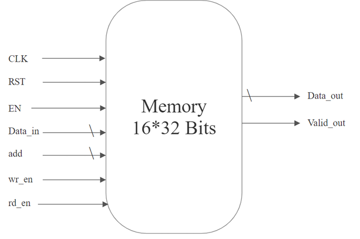

# Full Verification Environment for 16x32 Memory
>The verification environment is designed to validate the functionality and performance of a 16x32 memory module.
>The environment uses SystemVerilog for its testbench, which includes a testbench architecture that incorporates various components such as a driver, monitor, scoreboards, and coverage.

## ⚙️ Memory Specs
**Memory Module Description** 

The memory module Memory is parameterized with a depth of 4 (which results in 16 addressable locations) and a data width of 32 bits. It has the following ports:

   

  
| Command | Description |
| :---: | :---: |
| **`CLK`** | Clock signal |
| **`EN`** | Enable signal to activate memory operations |
| **`rst`** | Reset signal (active low) |
| **`wr_en`** | Write enable signal (active low) |
| **`rd_en`** | Read enable signal (active low) |
| **`add`** | Address for memory access |
| **`Data_in`** | Data to be written into memory. |
| **`valid_out`** | Output signal to indicate valid data |
| **`Data_out`** | Output data read from memory |

## 📝Functionality
**1-Initialization**: On reset (`rst` is low), all memory locations are set to 32'hXXXXXXXX and arr_add (address tracker) is reset.

**2-Write Operation**: When `EN` is high and `wr_en` is high while `rd_en` is low, data is written to the memory at the specified address, and the address is tracked.

**3-Read Operation**: When `EN` is high and `rd_en` is high while `wr_en` is low, the module checks if the address has valid data and updates the `Data_out` and valid_out accordingly.

**4-Invalid Operations**: If both `wr_en` and `rd_en` are high or `EN` is low, the `valid_out` is set to 0, and `Data_out` is invalid.

## Verification Environment

