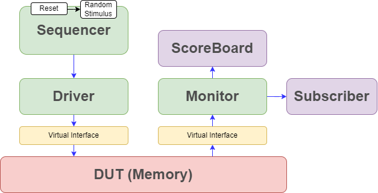
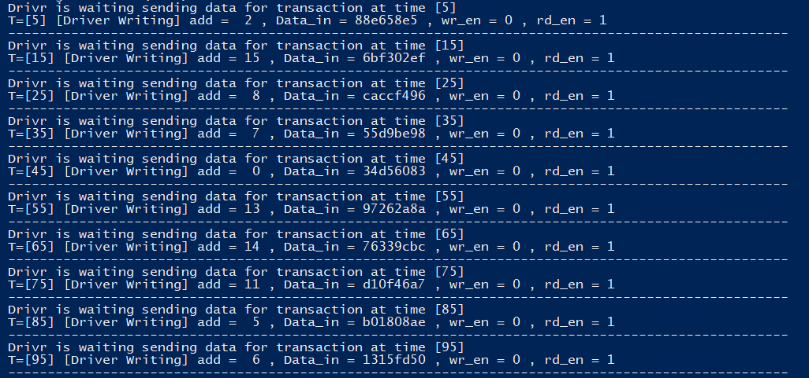

# Full Verification Environment for 16x32 Memory
>The verification environment is designed to validate the functionality and performance of a 16x32 memory module.
>The environment uses SystemVerilog for its testbench, which includes a testbench architecture that incorporates various components such as a driver, monitor, scoreboards, and coverage.

## ⚙️ Memory Specs
**Memory Module Description** 

The memory module Memory is parameterized with a depth of 4 (which results in 16 addressable locations) and a data width of 32 bits. It has the following ports:

   

  
| Command | Description |
| :---: | :---: |
| **`CLK`** | Clock signal |
| **`EN`** | Enable signal to activate memory operations |
| **`rst`** | Reset signal (active low) |
| **`wr_en`** | Write enable signal (active low) |
| **`rd_en`** | Read enable signal (active low) |
| **`add`** | Address for memory access |
| **`Data_in`** | Data to be written into memory. |
| **`valid_out`** | Output signal to indicate valid data |
| **`Data_out`** | Output data read from memory |

## 📝Functionality
**1-Initialization**: On reset (`rst` is low), all memory locations are set to 32'hXXXXXXXX and arr_add (address tracker) is reset.

**2-Write Operation**: When `EN` is high and `wr_en` is high while `rd_en` is low, data is written to the memory at the specified address, and the address is tracked.

**3-Read Operation**: When `EN` is high and `rd_en` is high while `wr_en` is low, the module checks if the address has valid data and updates the `Data_out` and valid_out accordingly.

**4-Invalid Operations**: If both `wr_en` and `rd_en` are high or `EN` is low, the `valid_out` is set to 0, and `Data_out` is invalid.

## 🔷Verification Environment
It represents a verification environment for a memory module in a simulation testbench. 
It sets up and manages various components needed for verification, such as the driver, monitor, sequencer,subscriber, and scoreboard.

   

### **◽️ Transaction:**

A class which is used to represent and manage transactions in a verification environment, including constraints and display functions for debugging purposes and also includes the pin level of the DUT.

**Disp():** This function is used for debugging and displaying the contents of a Transaction object.

 - **str Parameter:**     Determines the type of display message and the Conditions are:
   
    - **"Driver Writing":** Displays information relevant to writing transactions, including address, data, and control signals.

    - **"Driver Reading":** Displays information relevant to reading transactions, including enable signal and address.

    - **"Monitor":**        Displays monitored data, including enable signal, address, data output, and validity.

    - **"ScoreBoard":**     Displays the address and data input for scoreboard verification.
  

            function void Disp (string str ="");
                if (str == "Driver Writing") begin
                    $display("T=[%0t] [%s] add = %d , Data_in = %h , wr_en = %d , rd_en = %d " , $time , str,add,Data_in,wr_en,rd_en);
                    $display("---------------------------------------------------------------------------------------------------");
                end else if (str == "Driver Reading") begin
                    $display("T=[%0t] [%s] EN = %d , add = %d " , $time , str,EN,add);
                    $display("---------------------------------------------------------------------------------------------------");
                end else if (str == "Monitor") begin
                    $display("T=[%0t] [%s] EN = %d , add = %d , Data_out = %h , valid_out = %d" , $time , str,EN,add,Data_out,valid_out);
                    $display("---------------------------------------------------------------------------------------------------");
                end else if (str == "ScoreBoard")begin 
                    $display("[%s]  add = %d , Data_in = %h",str,add,Data_in);    
                end
            endfunction

### **◽️ Sequencer:**
The Sequencer class is designed to manage the flow of transactions between different mailboxes in a verification testbench. It can generate data and place it into different mailboxes, as well as read data from mailboxes.

- **Constructor (`new` Function):** Initializes the class with mailboxes and events. These parameters are used to configure the class for specific testbench interactions.

- **Data Generation and Sending:** The generate_data task is responsible for creating and sending transactions to the specified mailboxes. This is typically used to drive data into the DUT (Design Under Test).

- **Data Reading:** The read_data task handles generating and sending transactions to another mailbox, which could be used to check responses or interact with other components.

### **◽️ Driver:**

The driver class interacts with the DUT by sending and receiving transactions via the mailbox and a virtual interface (vif). The driver handles two types of tasks:

- **new():** Constructor function for the Driver class. It initializes the virtual interface, mailboxes, and events.

      function new(virtual intf vif, mailbox ENV_mb, mailbox ENV2_mb, event Gn_dn, event Rd_dn);
          vif_dr  = vif;
          dr_mb   = ENV_mb;
          dr2_mb  = ENV2_mb;
          Gen_dn  = Gn_dn; 
          Read_dn = Rd_dn;
      endfunction

- **mem_reset:** Resets the memory by setting intf_rst to 0. This task is used to reset the DUT.

      task mem_reset();
        vif_dr.intf_rst = 0'b0;
      endtask

- **send_data:** A task waits for a transaction object from dr_mb, then updates the virtual interface signals with the transaction data, and signals the Gen_dn event. The forever loop allows continuous operation until terminated by external control.

   

- **get_data:** A task waits for a transaction object from dr2_mb, then updates the virtual interface signals and signals the Read_dn event. Similar to send_data, it operates continuously.

### **◽️ Monitor:**

The Monitor class is used to observe and capture the output from the DUT (Design Under Test) by monitoring the virtual interface signals and then sending these captured transactions to a mailbox for further processing or verification.

get_output task: This task continuously runs in a `forever` loop and performs the following:

  - **@(Read_dn):** Waits for the `Read_dn` event to be triggered.
  
  - **Capture DUT Signals**: Reads values from the virtual interface `vif_mo` and assigns them to the `Transaction` object `T1`.
  
  - **Put Transaction in Mailbox:** Stores the captured `Transaction` object `T1` in the mailbox `Mr_mb` for further processing or verification.

### **◽️ ScoreBoard:**

This class code is a key component in a testbench environment, used for checking the correctness of the DUT (Design Under Test) by comparing expected results against actual results we get from the sequencer at first.

- mailbox #(Transaction) SBS_mb, SBM_mb: Two mailboxes are used to receive Transaction objects:

  - **SBS_mb:** Likely used to receive transactions with expected data from the sequencer.

  - **SBM_mb:** Likely used to receive transactions with actual data output from the DUT.

- **logic [31:0] memSB [0:15]:** A memory array (memSB) of 16 32-bit elements. This is used to store expected data for comparison.

**Checking task:** Continuously runs in a forever loop to:
 - **Receive Transaction:** Uses SBM_mb.get(T2) to get a transaction from SBM_mb.
 - **Compare Data:** Compares T2.Data_out (actual data) with memSB[T2.add] (expected data). If they match, it displays "Success"; otherwise, it displays "Failed".

   

#### About The Author

**Author**: *Ziad Ahmed Mamdoh*

**Personal Email**: *ziadahmed1447@gmail.com*

**Education**: *Electronics and communication department.*

**College**: *Faculty of Engineering, Assiut university, Egypt.*

**Brief info.**: *Interested in Digital IC Design and Verification.*

 

